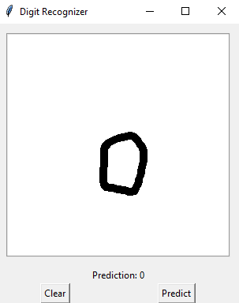
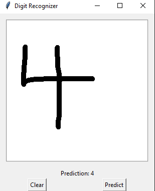
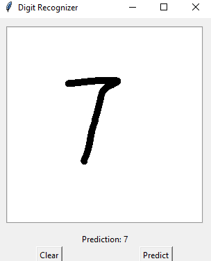

# Handwritten Digit Recognition

This project is a Handwritten Digit Recognition system built using TensorFlow and Keras. The model is trained on the MNIST dataset, which consists of 60,000 training images and 10,000 testing images of handwritten digits from 0 to 9. The application provides a graphical user interface (GUI) for users to draw digits on a canvas, which are then recognized by the trained model.

## Table of Contents

- [Introduction](#introduction)
- [Model](#model)
- [Dataset](#dataset)
- [Requirements](#requirements)
- [Installation](#installation)
- [Usage](#usage)
- [Example Outputs](#example-outputs)

## Introduction

Handwritten Digit Recognition is a common task in computer vision and machine learning. The goal of this project is to create a system that can accurately recognize handwritten digits drawn by users. This project demonstrates the use of neural networks for image classification and provides a simple user interface for testing the model.

## Model

The model used in this project is a Convolutional Neural Network (CNN) implemented using TensorFlow and Keras. The architecture consists of the following layers:

- Input Layer: Accepts 28x28 grayscale images.
- Convolutional Layer: 32 filters, 3x3 kernel size, ReLU activation.
- MaxPooling Layer: 2x2 pool size.
- Convolutional Layer: 64 filters, 3x3 kernel size, ReLU activation.
- MaxPooling Layer: 2x2 pool size.
- Flatten Layer: Flattens the 2D matrix into a vector.
- Dense Layer: 128 units, ReLU activation.
- Output Layer: 10 units (one for each digit), softmax activation.

The model is trained using the Adam optimizer and categorical cross-entropy loss.

## Dataset

The MNIST dataset is used for training and testing the model. It contains 70,000 images of handwritten digits (60,000 for training and 10,000 for testing).

## Requirements

- Python 3.7 or higher
- TensorFlow 2.x
- Keras
- NumPy
- Pillow (PIL)
- Matplotlib
- Tkinter

## Installation

1. Clone the repository:
    ```sh
    git clone https://github.com/your-username/handwritten-digit-recognition.git
    cd handwritten-digit-recognition
    ```

2. Install the required packages:
    ```sh
    pip install -r requirements.txt
    ```

## Usage

1. Run the application:
    ```sh
    python app.py
    ```

2. Draw a digit on the canvas and click the "Predict" button to see the predicted digit.

## Example Outputs

Below are some example outputs from the model:




